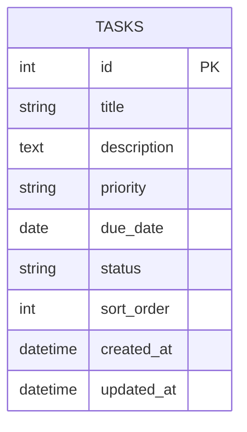

# タスク管理アプリ データベース設計書

本書は [要件定義書](./要件定義書.md) の「5. データ項目定義」を詳細化したものである。

---

## 1. データ項目一覧(カード/タスク)

| 項目名 | 必須/任意 | 型 | 備考 |
|---|---|---|---|
| タイトル | 必須 | 文字列 | 空では作成不可 |
| 説明文 | 任意 | 文字列(複数行) | 未入力可 |
| 優先度 | 必須 | 高 / 中 / 低 の選択式 | |
| 期限 | 任意 | 日付 | |
| ステータス | 必須 | 未着手 / 作業中 / 完了 | カード作成時のデフォルトは「未着手」 |
| 並び順 | システム管理 | 数値など | 同一列内の表示順を保持するための内部データ |

※担当者(アサイン)の項目は持たない(1人利用のため不要)。

---

## 2. ER図

想定利用者が1人(ログイン機能なし)のため、管理するエンティティは「タスク(TASKS)」の1つのみとなる。列(未着手/作業中/完了)はユーザーが追加・編集できない固定値のため、独立したテーブルにはせず `status` 属性で表現する。

他エンティティとのリレーションは存在しないため、ER図は単一エンティティの構成となる。

---

## 3. テーブル定義

### TASKS

| カラム名 | 型(PostgreSQL) | PK/FK | NULL | 備考 |
|---|---|---|---|---|
| id | BIGSERIAL | PK | NOT NULL | 自動採番の主キー |
| title | VARCHAR(255) | | NOT NULL | タスクのタイトル |
| description | TEXT | | NULL可 | 説明文。未入力可 |
| priority | VARCHAR(10) | | NOT NULL | "高" / "中" / "低" のいずれか |
| due_date | DATE | | NULL可 | 期限。未設定可 |
| status | VARCHAR(20) | | NOT NULL | "未着手" / "作業中" / "完了" のいずれか。デフォルトは "未着手" |
| sort_order | INTEGER | | NOT NULL | 同一status内での表示順を保持する |
| created_at | TIMESTAMP | | NOT NULL | 作成日時 |
| updated_at | TIMESTAMP | | NOT NULL | 更新日時 |

※ `id` / `created_at` / `updated_at` は要件定義書の「データ項目定義」には無いが、実DBで運用する上で一般的に必要となるため、設計フェーズで追加した。

---

## 4. 技術構成との対応

- 使用するDB製品はPostgreSQLに決定した
- バックエンドはJava/SpringBootで実装し、Spring Data JPAを用いてTASKSテーブルにアクセスする。テーブル定義自体はFlywayのマイグレーションファイル(SQL)で管理する
- 詳細な技術選定・理由は [技術スタック](./技術スタック.md) を参照
