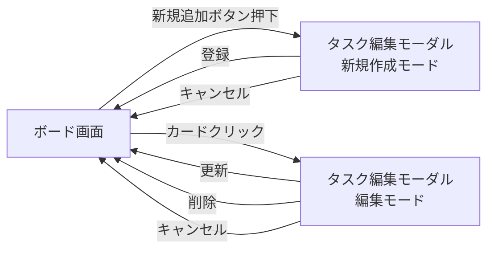
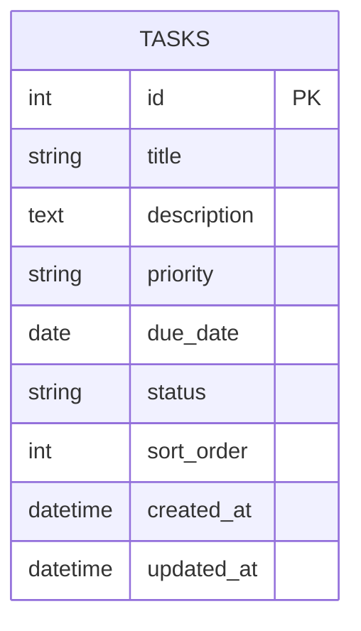

# タスク管理アプリ 基本設計書

本書は [要件定義書](./要件定義書.md) を受けて、画面設計・データ設計を具体化するものである。

---

## 1. 画面設計

### 1.1 画面遷移図

### 1.2 画面構成
画面構成・入力項目の詳細は要件定義書「4. 画面仕様」を参照。本書では画面遷移とデータの流れの整理に焦点を当てる。

---

## 2. データ設計

### 2.1 ER図

想定利用者が1人(ログイン機能なし)のため、管理するエンティティは「タスク(TASKS)」の1つのみとなる。列(未着手/作業中/完了)はユーザーが追加・編集できない固定値のため、独立したテーブルにはせず `status` 属性で表現する。

他エンティティとのリレーションは存在しないため、ER図は単一エンティティの構成となる。

### 2.2 テーブル定義

#### TASKS

| カラム名 | 型(PostgreSQL) | PK/FK | NULL | 備考 |
|---|---|---|---|---|
| id | BIGSERIAL | PK | NOT NULL | 自動採番の主キー |
| title | VARCHAR(255) | | NOT NULL | タスクのタイトル |
| description | TEXT | | NULL可 | 説明文。未入力可 |
| priority | VARCHAR(10) | | NOT NULL | "高" / "中" / "低" のいずれか |
| due_date | DATE | | NULL可 | 期限。未設定可 |
| status | VARCHAR(20) | | NOT NULL | "未着手" / "作業中" / "完了" のいずれか。デフォルトは "未着手" |
| sort_order | INTEGER | | NOT NULL | 同一status内での表示順を保持する |
| created_at | TIMESTAMP | | NOT NULL | 作成日時 |
| updated_at | TIMESTAMP | | NOT NULL | 更新日時 |

※ `id` / `created_at` / `updated_at` は要件定義書「5. データ項目定義」には無いが、実DBで運用する上で一般的に必要となるため、設計フェーズで追加した。

### 2.3 技術構成との対応
- 使用するDB製品はPostgreSQLに決定した
- バックエンドはJava/SpringBootで実装し、Spring Data JPAを用いてTASKSテーブルにアクセスする。テーブル定義自体はFlywayのマイグレーションファイル(SQL)で管理する
- 詳細な技術選定・理由は [技術スタック](./技術スタック.md) を参照
