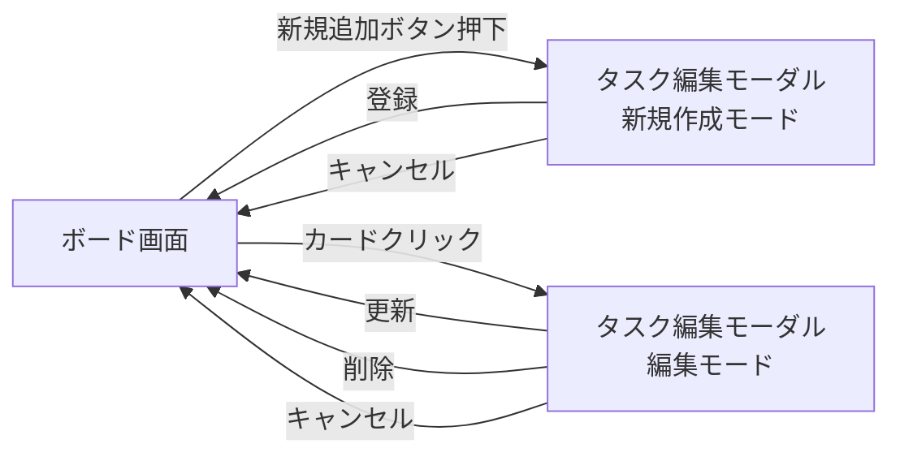

# タスク管理アプリ 画面設計書

本書は [要件定義書](./要件定義書.md) の「4. 画面仕様」を詳細化したものである。

---

## 1. 画面構成

本アプリは以下の2つの画面(状態)で構成する。

| 画面 | 概要 |
|---|---|
| ボード画面 | アプリ起動時に表示するメイン画面。「未着手」「作業中」「完了」の3列とタスクカードを表示する |
| タスク編集モーダル | タスクの新規作成・編集を行うための入力フォーム(ボード画面上にオーバーレイ表示) |

---

## 2. ボード画面

- 画面上部にアプリタイトルを表示する
- 画面中央に3つの列(未着手/作業中/完了)を横に並べて表示する
- 各列には以下を表示する
  - 列名(見出し)
  - 列内のタスクカード一覧(縦に並べる)
  - タスクを新規追加するためのボタン
- 各タスクカードには以下の情報を表示する
  - タイトル
  - 優先度(色分け表示)
  - 期限(設定されている場合。期限切れ・期限間近の場合は強調表示)
- カードをクリックするとタスク編集モーダルを開く
- カードはドラッグ&ドロップで列間移動・同列内並び替えができる

---

## 3. タスク編集モーダル

新規作成時・編集時で共通の画面とし、以下の入力項目を持つ。

| 項目 | UI部品 | 備考 |
|---|---|---|
| タイトル | テキスト入力 | 必須項目であることが分かる表示にする |
| 説明文 | 複数行テキストエリア | 任意項目 |
| 優先度 | セレクトボックス(高/中/低) | 必須。デフォルト値は今後の設計で決定 |
| 期限 | 日付入力(datepicker等) | 任意項目 |

- 「登録」または「更新」ボタンで保存し、モーダルを閉じてボード画面に戻る
- 「キャンセル」ボタンで変更を破棄してモーダルを閉じる
- 編集時のみ「削除」ボタンを表示する
- 入力値の詳細なバリデーションルール(文字数上限、エラーメッセージ文言等)は実装フェーズで定義する。本書では「タイトル・優先度は必須項目である」という制約のみを定義する。

---

## 4. 画面遷移図

